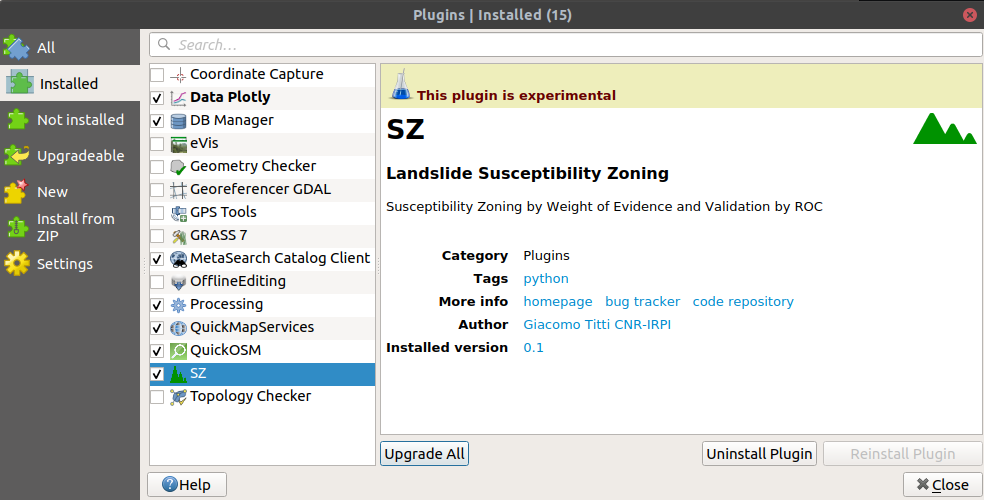
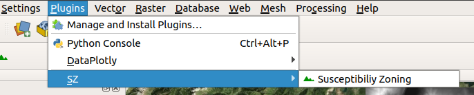
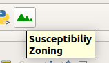
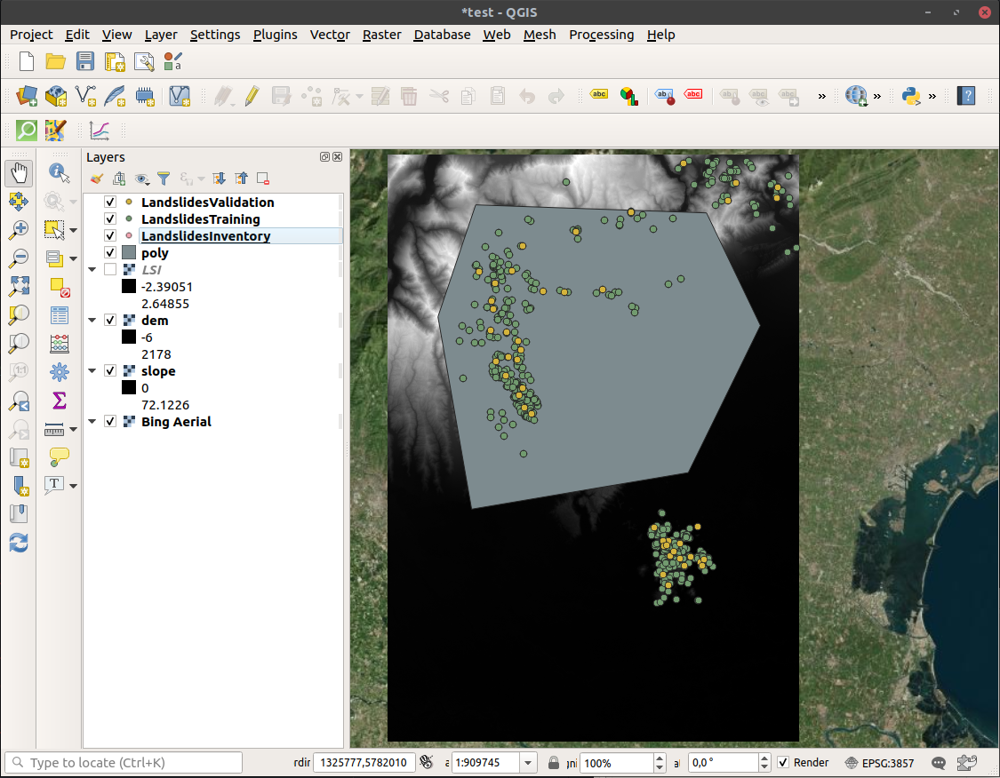
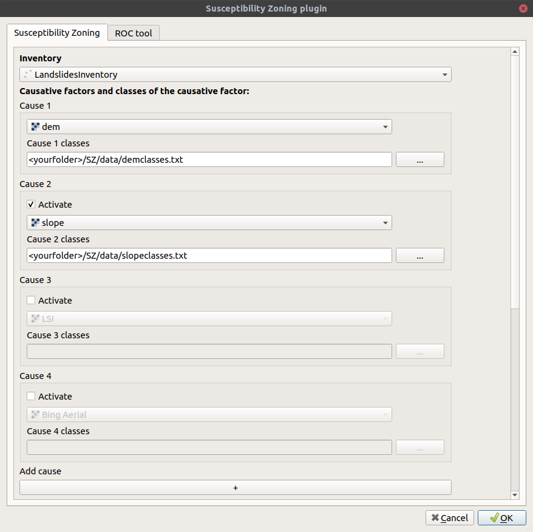
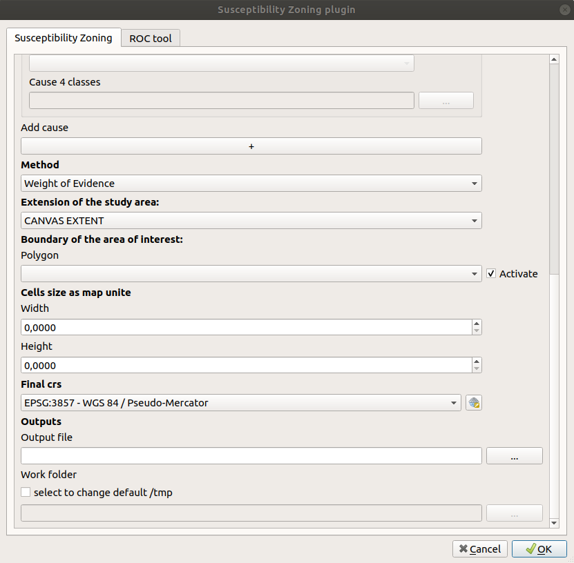
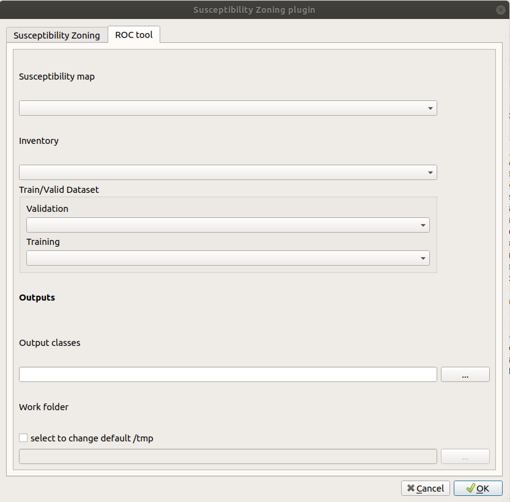

# Susceptibility Zoning plugin (SZ)

**! This README file is a draft and is currently being improved**

## Introduction

This repository contains the code for a plugin for [QGIS](https://www.qgis.org), called "Susceptibility Zoning plugin", aiming at creating maps of susceptibility to various natural forcing elements.

The plugin has been developed with a main focus and application towards landslides susceptibility, but it can be applied to different types of natural events or inter-disciplinary applications.

The plugin uses a bi-variate "Weight of Evidence" (WoE) model and the Frequency Ratio (FR) as first statistical methods to evaluate the susceptibility of a study area to specific events. Additional methods are being implemented and will be added to the plugin as soon they are ready.

## Installation

The SZ plugin is not an official QGIS plugin.

It can be installed on QGIS3.x cloning the repository or downloading it as zip file (and than unzipping it) and copying the _SZ_ folder in your local python/plugin folder (read [here](https://docs.qgis.org/3.10/en/docs/user_manual/plugins/plugins.html#core-and-external-plugins) for more information).

At the end you should have the SZ plugin in your list of installed plugins (in the mainbar _Plugins_ > _Manage and install plugins_)

and available both from _Plugins_ > _SZ_ > _Susceptibility zoning_

or from the icon. 

## Statistical methods

### Weight of Evidence

The WoE is a bi-variate statistical method used for classification. It was introduced by Agterberg et al. (1989) and then by [Bonham-Carter et al. (1988)](https://agupubs.onlinelibrary.wiley.com/doi/abs/10.1029/SC010p0015) for spatial analysis. The model evaluates the predictive power of an independent variable (cause) in relation to the dependent variable (in our study, landslides) by the assignment of two weights (_W+_, _W-_).

The positive weight defines that the independent variable is favorable to landslide occurrence; on the contrary the negative one. The sum of _W+_ and _W_- and of all the independent variables considered provides the Susceptibility Index (SI).

_Npx1_ is the number of pixels representing the presence of both independent variable and dependent variable; _Npx2_ is the number of pixels representing the presence of dependent variable and absence of independent variable; _Npx3_ is the number of pixels representing the presence of independent variable and absence of dependent variable; _Npx4_ is the number of pixels representing the absence of both independent variable and dependent variable [(Dahal et al., 2008)](https://link.springer.com/article/10.1007/s00254-007-0818-3)

### Frequency Ratio

As the WoE, the Frequency Ratio (FR) is a simple bi-variate statistical method often used for classification.

_FR = (Npx1/Npx2)/(ΣNpx1/ΣNpx2)_

_SI = ΣFR_

_Npx1_ = The number of pixels containing the dependent variable in a class; _Npx2_ = Total number of pixels of each class in the whole area; _ΣNpx1_ = Total number of pixels containing the event; _ΣNpx2_ = Total number of pixels in the study area [(Kahan et al., 2019)](https://www.sciencedirect.com/science/article/pii/S1110982316300989)

## Usage

As an example on how to use the plugin, you can access a test QGIS project and some data in the [data](https://github.com/CNR-IRPI-Padova/SZ/tree/master/data) folder.

Open the _test.qgz_ project in your QGIS and you'll see some data located in an area of the Veneto region (Italy).

### Input data

* LandslidesInventory is ...
* LandslideValidation is ...
* LandslideTraining is ...
* poly is ...
* dem is ...
* slope is ...

### Classification of zones

In the _data_ folder there are also 2 text files (_demclasses.txt_ and _slopeclasses.txt_) providing classification of zones for the two causes (dem and slope1).

## The plugin interface

When you start the plugin (through menu or icon), the interface shows you two main tabs (_Susceptibility Zoning_ and _ROC tool_).

The _Susceptibility Zoning_ tab allows you to set input data, parameters and output file and run the classification, while the _ROC tool_ allows you to create a [ROC curve](https://en.wikipedia.org/wiki/Receiver_operating_characteristic) graphic.

### Susceptibility Zoning

_Fig. 1 Input causes from the main GUI section of SZ plugin for susceptibility mapping._

_Fig. 2 Rest of input from the main GUI section of SZ plugin for Susceptibility mapping._

### ROC tool

_Fig. 3 Input data for Susceptibility Index ROC based classification and validation._

## Applications

_A few examples and references about Belt and Road Initiative_

[Landslide inventory](./data/LandslidesInventory.shp) from [Geoportale Regione Veneto](https://idt2.regione.veneto.it/)

## Presentations

_A list of presentations made about the plugin and its applications_

## Collaborations

## Credits

Giacomo Titti and Alessandro Sarretta, Padova, March 2020

...
