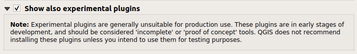
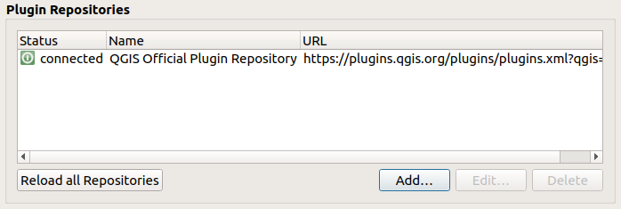
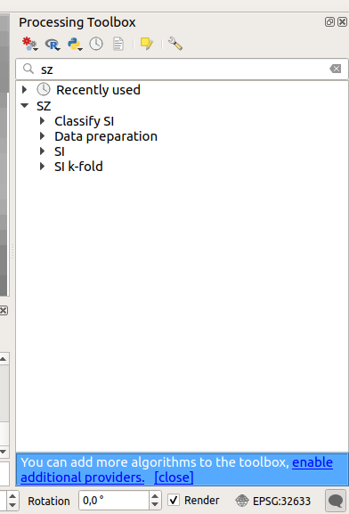
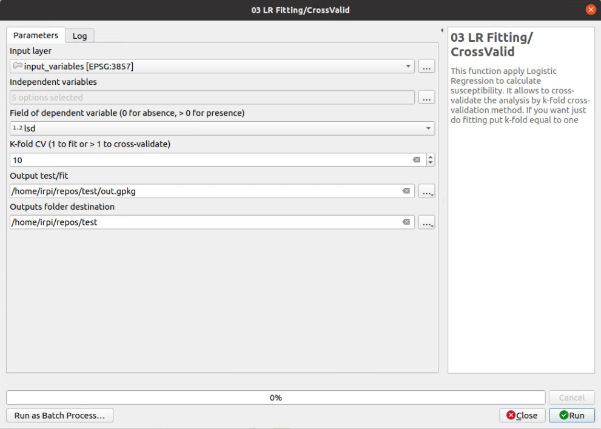
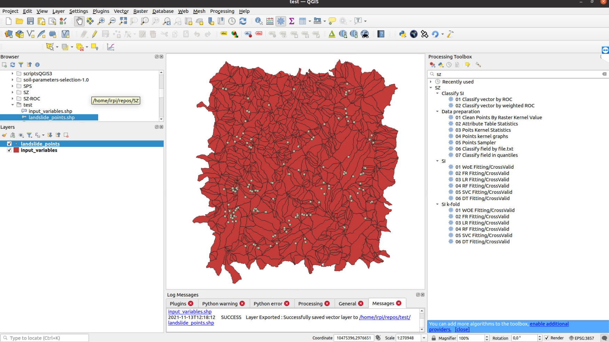
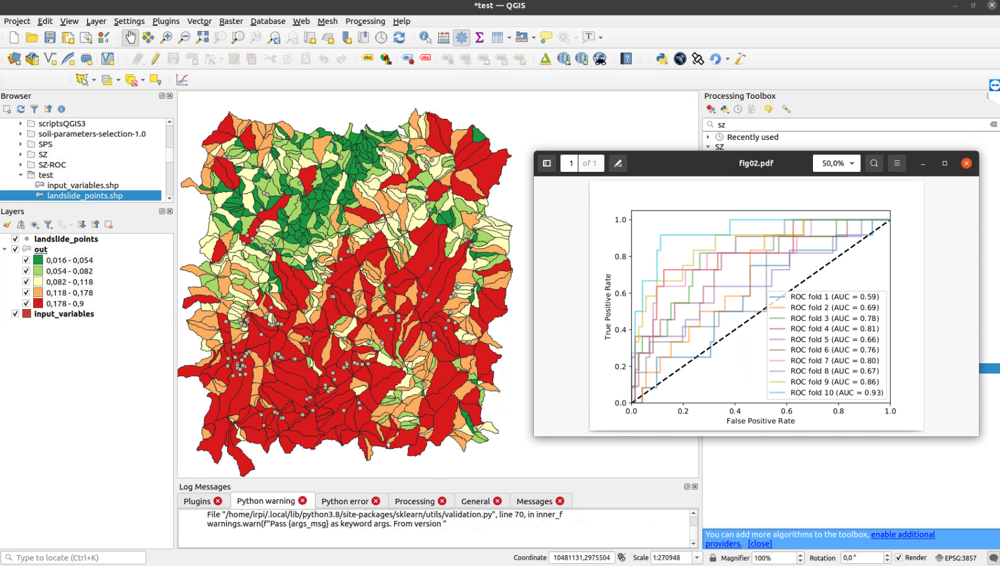

# Susceptibility Zoning plugin (SZ)


## Introduction

This repository contains the code for a plugin for [QGIS](https://www.qgis.org), called "Susceptibility Zoning plugin" (SZ-plugin), aiming at creating maps of susceptibility to various natural forcing elements.

The plugin has been developed with a main focus and application towards landslide susceptibility, but it can be applied to different types of natural events or inter-disciplinary applications.

The plugin uses several types of statistical models for susceptibility evaluation, such as:

* Weight of Evidence
* Frequency Ratio
* Logistic Regression
* Decision Tree
* Support Vector Machine
* Random Forest

The plugin allows to cross-validate the results by simple random selection of test/train samples or allows to cross-validate by k-fold cross-validation method.


## Installation

The SZ plugin is not an official QGIS plugin.

#### Requirements

You need to install the basic dependencies to run the project on your system using ```pip``` (visit the [website](https://pip.pypa.io) to install pip):  
  
Windows, open OSGeo4W Shell (it is provided with QGIS installation) then launch the commands
```
cd path/to/downloded/folder/sz
pip install -r requirements.txt
```
or you can install them separately

Linux, open prompt (Ctrl+Alt+t) and run
```
cd path/to/downloded/folder/sz
pip3 install -r requirements_linux_mac.txt
``` 
or you can install them separately using ```sudo apt-get install python3-library```

#### Download and install

It can be installed on QGIS3.x adding the Plugin Repository to QGIS ```manage and install plugins```:
- flag ```show also experimental plugins```



- add plugin repository



- edit repository and add [https://sztools.github.io/SZ/sz.xml](https://sztools.github.io/SZ/sz.xml)


<p>

or

cloning the [GitHub repository](https://github.com/CNR-IRPI-Padova/SZ) or downloading it as zip file (and than unzipping it) and copying the ```sz_module``` folder in your local ```python/plugin``` folder (read [here](https://docs.qgis.org/3.10/en/docs/user_manual/plugins/plugins.html#core-and-external-plugins) for more information).

Lunch QGIS 3.x, and abilitate the plugin from ```manage and install plugin/installed/sz_processing```


<p>
  
At the end you should have the SZ plugin in your processing toolbox


<p>
  
### GUI

The functions are grouped into 3 cathegories:
* _Data preparation_
* _SI_
* _SI k-fold_
* _Classify SI_

_Data preparation_ functions can be used for data pre-processing
_SI_ functions run the statistic models for susceptibility, cross-validate by a simple random selection of train/test samples and evaluate the prediction capacity by ROC curves
_SI k-fold_ functions run the statistic models for susceptibility, cross-validate by k-fold method and evaluate the prediction capacity by ROC curves
_Classify SI_ functions allows to categorize the susceptibility index into _n_ classes on the base of AUC maximization.

### Input data of SI and SI k-fold functions

Input data for SI k-fold or SI functions should be a vector layer with a number of fields for independet variables ans a field for the dependent variable classified binomially: 0 for absence, >0 for presence.


 
### Test

A dataset and QGIS project are available in [test](./test_data) folder to test the plugin.

 




## Third-part libraries and plugins used

* [GDAL](https://gdal.org/)
* [Scikit-learn](https://scikit-learn.org/stable/index.html)
* [Matplotlib](https://matplotlib.org/)
* [Plotly](https://plotly.com/)
* [Pandas](https://pandas.pydata.org/)

## Tutorial

video tutorial: https://www.youtube.com/watch?v=XpsiCkVF11s
  
## Application

Titti G, Sarretta A, Lombardo L, Crema S, Pasuto A and Borgatti L (2022) Mapping Susceptibility With Open-Source Tools: A New Plugin for QGIS. Front. Earth Sci. 10:842425. doi: 10.3389/feart.2022.842425
  
[Referenced dataset](https://zenodo.org/record/6575572)

## Publications

_A few examples and references about applications_
  
Titti G, Sarretta A, Lombardo L, Crema S, Pasuto A and Borgatti L (2022) Mapping Susceptibility With Open-Source Tools: A New Plugin for QGIS. Front. Earth Sci. 10:842425. doi: 10.3389/feart.2022.842425

Titti, G., van Westen, C., Borgatti, L., Pasuto, A., & Lombardo, L. (2021). When Enough Is Really Enough? On the Minimum Number of Landslides to Build Reliable Susceptibility Models. Geosciences, 11(11), 469.

Titti, G., Borgatti, L., Zou, Q., Cui, P., & Pasuto, A. (2021). Landslide susceptibility in the Belt and Road Countries: continental step of a multi-scale approach. Environmental Earth Sciences, 80(18), 1-18.[10.1007/s12665-021-09910-1](https://doi.org/10.1007/s12665-021-09910-1)

Titti, G., Borgatti, L., Zou, Q., Pasuto, A., 2019. Small-Scale landslide Susceptibility Assessment. The Case Study of the Southern Asia. Proceedings 30, 14. [10.3390/proceedings2019030014](https://doi.org/10.3390/proceedings2019030014)

## Presentations

_A list of presentations made about the plugin and its applications_

Titti, Giacomo, Sarretta, Alessandro, Crema, Stefano, Pasuto, Alessandro, & Borgatti, Lisa. (2020, March). Sviluppo e applicazione del plugin Susceptibility zoning per il supporto alla pianificazione territoriale. Zenodo. [10.5281/zenodo.3723353](https://zenodo.org/record/3723353)

## Credits

Giacomo Titti, Alessandro Sarretta and Luigi Lombardo, Padova, November 2021

please cite as: Giacomo Titti, Alessandro Sarretta and Luigi Lombardo. (2021). CNR-IRPI-Padova/SZ: SZ plugin (Version v1.0). Zenodo.
  
## Contacts
If you have any problem, please write to giacomotitti@gmail.com


