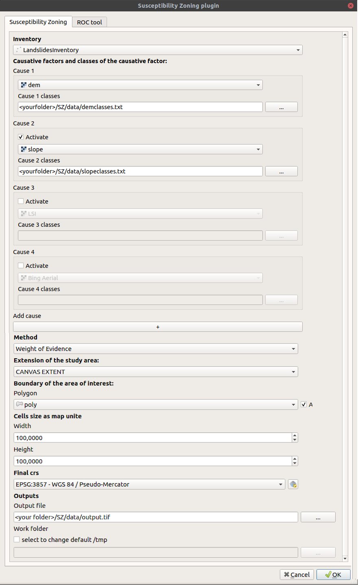
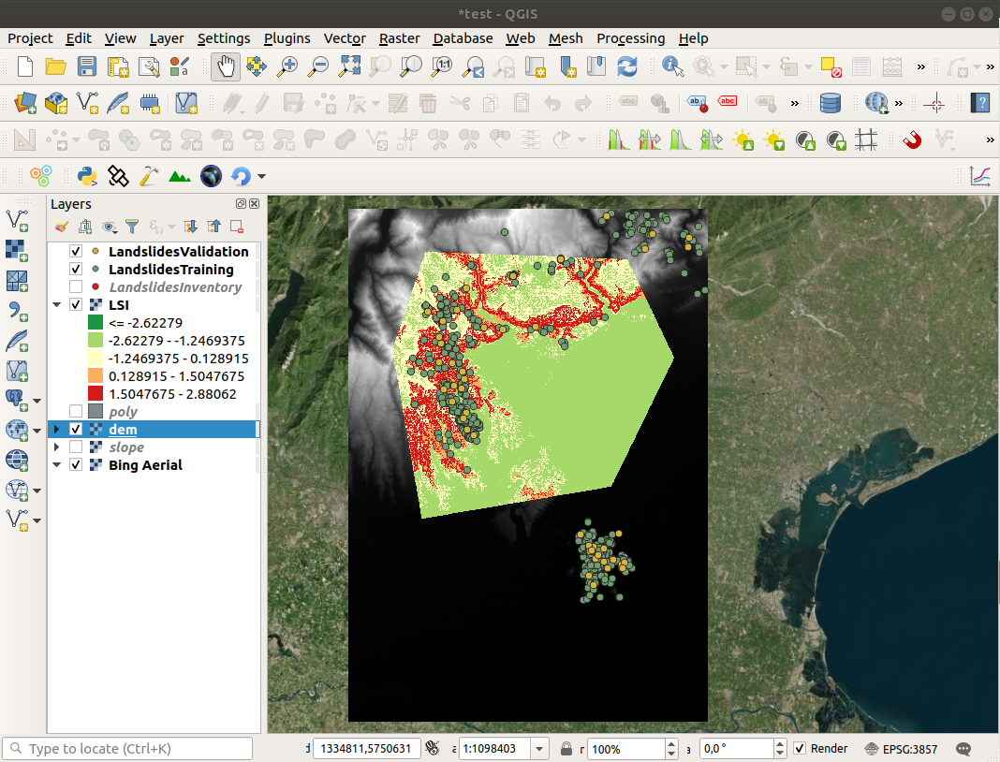
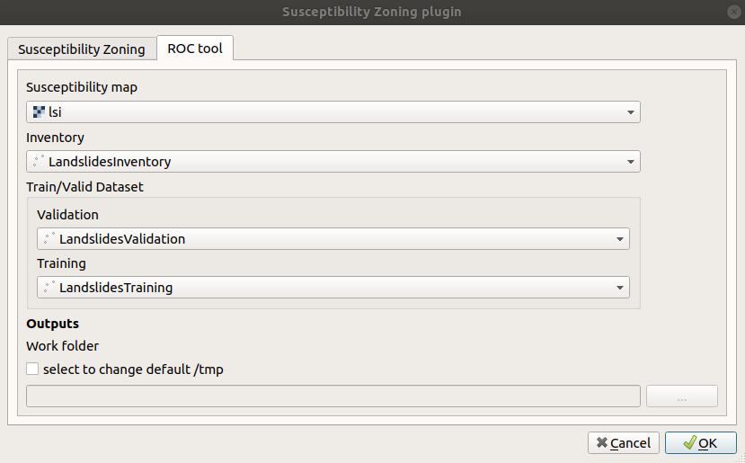
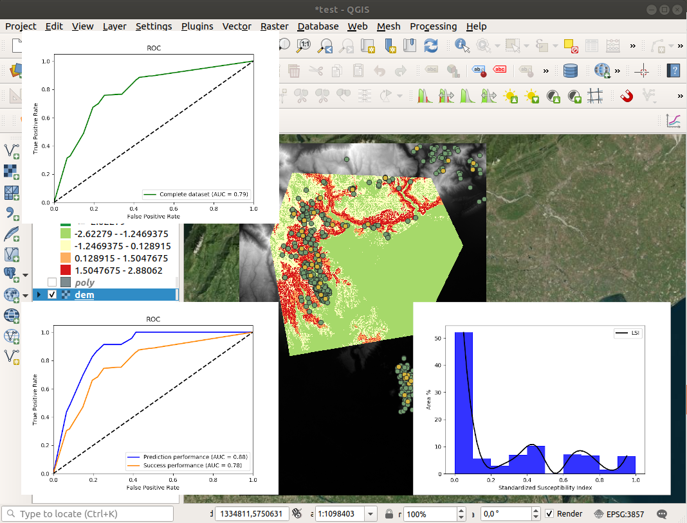

# Susceptibility Zoning plugin (SZ)

## Introduction

This repository contains the code for a plugin for [QGIS](https://www.qgis.org), called "Susceptibility Zoning plugin", aiming at creating maps of susceptibility to various natural forcing elements.

The plugin has been developed with a main focus and application towards landslides susceptibility, but it can be applied to different types of natural events or inter-disciplinary applications.

The plugin uses a bi-variate "Weight of Evidence" (WoE) model and the Frequency Ratio (FR) as first statistical methods to evaluate the susceptibility of a study area to specific events. Additional methods are being implemented and will be added to the plugin as soon they are ready, such as:

* logistic regression
* neural network
* linear regression
* multi-criteria decision


## Installation

The SZ plugin is not an official QGIS plugin.

It can be installed on QGIS3.x cloning the repository or downloading it as zip file (and than unzipping it) and copying the _SZ_ folder in your local python/plugin folder (read [here](https://docs.qgis.org/3.10/en/docs/user_manual/plugins/plugins.html#core-and-external-plugins) for more information).

At the end you should have the SZ plugin in your list of installed plugins (in the mainbar _Plugins_ > _Manage and install plugins_)


<p>

and available both from _Plugins_ > _SZ_ > _Susceptibility zoning_


<p>

or from the icon. 

Then you need to install the basic dependencies to run the project on your system:

```
cd sz
pip install -r requirements.txt
```

## Statistical methods


### Weight of Evidence

The WoE is a bi-variate statistical method used for classification. It was introduced by Agterberg et al. (1989) and then by [Bonham-Carter et al. (1988)](https://agupubs.onlinelibrary.wiley.com/doi/abs/10.1029/SC010p0015) for spatial analysis. The model evaluates the predictive power of an independent variable (cause) in relation to the dependent variable (in our study, landslides) by the assignment of two weights (_W+_, _W-_).

The positive weight defines that the independent variable is favorable to landslide occurrence; on the contrary the negative one. The sum of _W+_ and _W_- and of all the independent variables considered provides the Susceptibility Index (SI).


<!-- W+ = ln \frac{\frac{Np_{x1}}{Np_{x1}+Np_{x2}}}{\frac{Np_{x3}}{Np_{x3}+Np_{x4}}} -->

<br>


<!-- W- = ln \frac{\frac{Np_{x2}}{Np_{x1}+Np_{x2}}}{\frac{Np_{x4}}{Np_{x3}+Np_{x4}}} -->

<br>


<!-- SI = \sum (W_{+} - W_{-}) -->

_Np<sub>x1</sub>_ is the number of pixels representing the presence of both independent variable and dependent variable; _Np<sub>x2</sub>_ is the number of pixels representing the presence of dependent variable and absence of independent variable; _Np<sub>x3</sub>_ is the number of pixels representing the presence of independent variable and absence of dependent variable; _Np<sub>x4</sub>_ is the number of pixels representing the absence of both independent variable and dependent variable [(Dahal et al., 2008)](https://link.springer.com/article/10.1007/s00254-007-0818-3)

### Frequency Ratio

As the WoE, the Frequency Ratio (FR) is a simple bi-variate statistical method often used for classification.


<!-- FR = \frac{Np_{x1}/Np_{x2}}{\sum Np_{x1}/ \sum Np_{x2}} -->

<br>


<!-- SI = \sum FR -->

_Np<sub>x1</sub>_ = The number of pixels containing the dependent variable in a class; _Np<sub>x2<sub>_ = Total number of pixels of each class in the whole area; _&sum;Np<sub>x1</sub>_ = Total number of pixels containing the event; _&sum;Np<sub>x2</sub>_ = Total number of pixels in the study area [(Kahan et al., 2019)](https://www.sciencedirect.com/science/article/pii/S1110982316300989)

## Usage

As an example on how to use the plugin, you can access a test QGIS project and some data in the [data](https://github.com/CNR-IRPI-Padova/SZ/tree/master/data) folder.

Open the _test.qgz_ project in your QGIS and you'll see some data located in an area of the Veneto region (Italy). The DEM has been collected from [SRTM dataset](https://dds.cr.usgs.gov/srtm/) and the [landslide inventory](./data/LandslidesInventory.shp) from [Geoportale Regione Veneto](https://idt2.regione.veneto.it/).


### Input data

Susceptibility zoning:
* _LandslidesInventory.shp_ is the whole set of landslides events collected in the area;
* _dem.tif_ is the Digital Elevation Model from SRTM (cause 1);
* _slope.tif_ is the slope raster calculated from the DEM (cause 2);
* _poly.shp_ is the polygon which bounds the study area;
* In the _data_ folder there are also 2 text files (_demclasses.txt_ and _slopeclasses.txt_) providing classification of zones for the two causes (_dem_ and _slope_).

ROC tool:
* _LandslidesInventory.shp_ is the whole set of landslides events collected in the area;
* _LandslideValidation.shp_ is a part of the entire landslide inventory used for validation;
* _LandslideTraining.shp_ is the rest of the landslide inventory used to train the model.

## The plugin interface

When you start the plugin (through menu or icon), the interface shows you two main tabs (_Susceptibility Zoning_ and _ROC tool_).

The _Susceptibility Zoning_ tab allows you to set input data, parameters and output file and run the susceptibility analysis, while the _ROC tool_ allows you to evaluate the prediction and success capacity of the susceptibility model used by [Receiver Operating Characteristic (ROC)](https://en.wikipedia.org/wiki/Receiver_operating_characteristic) analysis.

### Susceptibility Zoning



_Input from the main GUI section of SZ plugin for susceptibility mapping._

The first required input is the _Inventory_: select the point shapefile with the inventory for your events (landslides in our example).

In the following boxes you can add several (default 4) causes connected with your susceptibility analysis. In the example we've added _dem_ and _slope_ raster datasets as the first 2 causes.

You can add even more than 4 causes clicking on the "+" symbol under the "Add cause" text.

Then you can select the method of analysis (currently _Weight of evidence_ and _Frequency Ratio_), the extent of the study area and a polygon to define the area of interest.

You can finally define the cell size, the CRS, the file name for the output and the folder for intermediate outputs (default _/tmp_).

 

### ROC tool



_Input data for Susceptibility Index ROC-based classification and validation._

The first input is the _Susceptibility Map_ (in our example is the output of the _Susceptibility zoning_ application)

The second required input is the _Inventory_: select the point shapefile with the inventory for your events (landslides in our example).

Then you can select the _Validation_ and _Training_ datasets: select the point shapefile with the part of the inventory for your events (landslides in our example).

You can finally define the folder for intermediate outputs (default _/tmp_).

 

## Third-part libraries and plugins used

* [GDAL](https://gdal.org/)
* [Scikit-learn](https://scikit-learn.org/stable/index.html)
* [Matplotlib](https://matplotlib.org/)
* [NumPy](https://numpy.org/)
* [Qt](https://www.qt.io/)
* [Plugin builder](https://g-sherman.github.io/Qgis-Plugin-Builder/)


## Applications

_A few examples and references about applications_

Titti, G., Borgatti, L., Zou, Q., Pasuto, A., 2019. Small-Scale landslide Susceptibility Assessment. The Case Study of the Southern Asia. Proceedings 30, 14. [10.3390/proceedings2019030014](https://doi.org/10.3390/proceedings2019030014)

## Presentations

_A list of presentations made about the plugin and its applications_

Titti, Giacomo, Sarretta, Alessandro, Crema, Stefano, Pasuto, Alessandro, & Borgatti, Lisa. (2020, March). Sviluppo e applicazione del plugin Susceptibility zoning per il supporto alla pianificazione territoriale. Zenodo. [10.5281/zenodo.3723353](https://zenodo.org/record/3723353)

## Credits

Giacomo Titti and Alessandro Sarretta, Padova, March 2020
please cite as: Giacomo Titti, & Alessandro Sarretta. (2020, May 25). CNR-IRPI-Padova/SZ: SZ plugin (Version v0.1). Zenodo. http://doi.org/10.5281/zenodo.3843275
